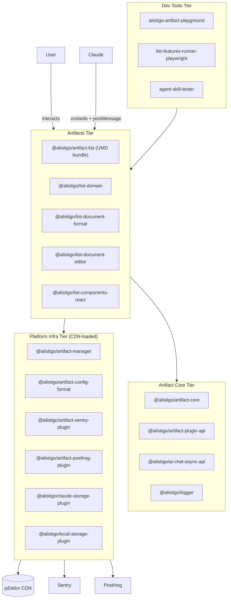
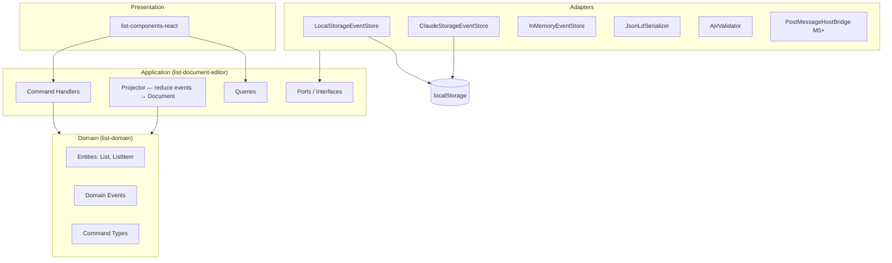
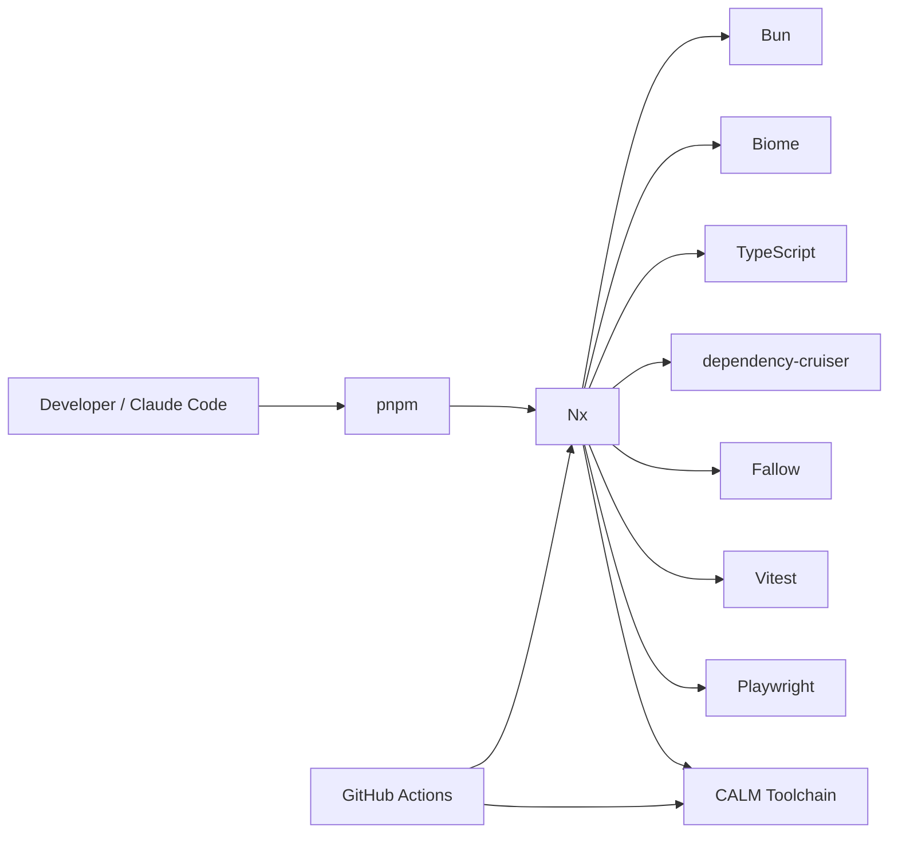

# Alistigo Architecture (CALM)

Architecture as Code for the Alistigo platform, using [CALM — Common Architecture Language Model](https://calm.finos.org) (FINOS open standard). See [ADR 0027](../docs/adrs/0027-architecture-as-code-calm.md) for the decision record.

## Principles

- **Architecture is the source of truth**: code conforms to the model, not vice versa
- **New elements are declared here before implementation**
- **CI validates CALM files** on every PR (`pnpm qa:arch-calm`)
- **AI tools (Claude Code, VS Code)** have architecture context via the CALM MCP server

## File Structure

```
architecture/
├── README.md                             ← you are here
├── patterns/                             ← reusable architectural patterns
│   ├── ddd-hexagonal.pattern.json        ← DDD hexagonal layer model
│   └── event-sourcing-cqrs.pattern.json  ← Event sourcing + CQRS
└── systems/                              ← concrete system architectures
    ├── alistigo-platform.arch.json       ← four-tier platform view
    ├── list-artifact-ddd.arch.json       ← list artifact internal DDD architecture
    ├── monorepo-toolchain.arch.json      ← dev toolchain and CI
    └── monorepo-packages.arch.json       ← every app/package/CLI as a node, wired by workspace:* deps
```

## Architecture Views

### 1. Platform — Four Tiers

```
alistigo-platform.arch.json
```

The Alistigo platform organises code into four independently-versioned tiers:



### 2. List Artifact — DDD Internals

```
list-artifact-ddd.arch.json  (uses patterns: ddd-hexagonal, event-sourcing-cqrs)
```



### 3. Monorepo Toolchain

```
monorepo-toolchain.arch.json
```



### 4. Package Dependency Graph

```
monorepo-packages.arch.json
```

Every app, package, and CLI tool in the workspace as a node (31 total: 1 app, 25 packages, 3 CLI tools, 2 actors), wired by their actual `workspace:*` dependencies from each `package.json`. This is the ground-truth, code-derived counterpart to the conceptual four-tier view above — useful as a fitness-function baseline once CALM-declared boundaries are compared against `dependency-cruiser` output (ADR 0027 §5).

## Adding New Architecture Elements

1. Add the node(s) to the relevant `.arch.json` file
2. Add any new relationships
3. Run `pnpm qa:arch-calm` to validate every CALM file is valid (the installed `calm validate` doesn't accept a bare directory, so this delegates to `scripts/validate-architecture.sh`)
4. Open a PR — CI will validate automatically
5. Then implement the code

**Never implement first and update architecture later.** Architecture is the contract.

## Tooling

```sh
# Validate all CALM files
pnpm qa:arch-calm

# Open the interactive CALM server (browse architecture in browser)
pnpm calm-studio

# Generate a scaffold architecture from a pattern
pnpm calm generate -p architecture/patterns/ddd-hexagonal.pattern.json -o architecture/systems/new-system.arch.json

# Validate a single file directly
pnpm calm validate -a architecture/systems/alistigo-platform.arch.json -f pretty

# Run the CALM CLI directly
pnpm calm --help
```

CALM MCP server support is not yet available as a stable npm package. When `@finos/calm-mcp` is released, wire it into `.mcp.json` (Claude Code) and `.vscode/mcp.json` (VS Code).
