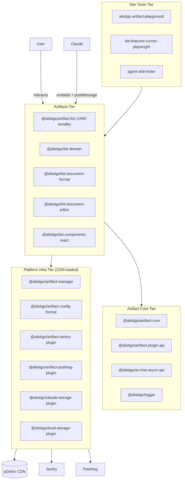
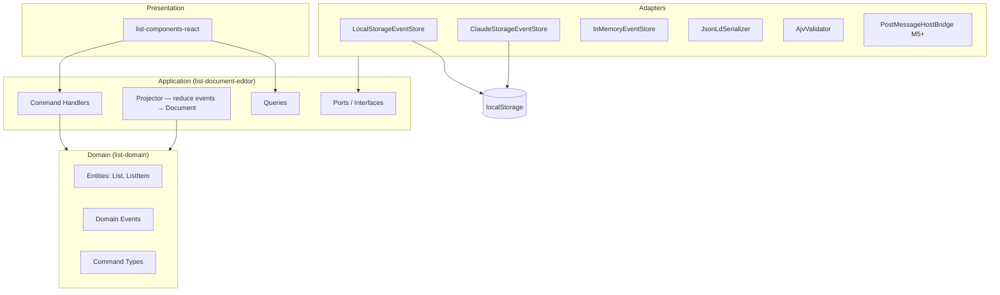
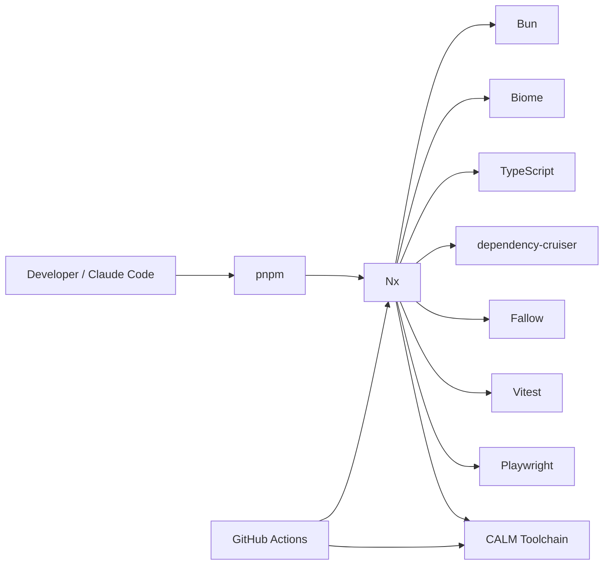
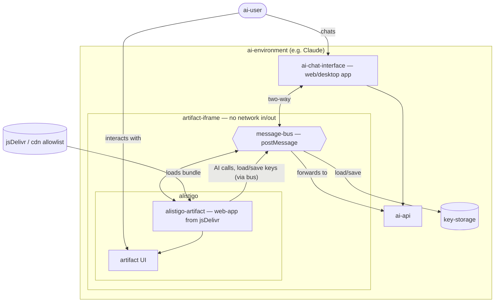

# @alistigo/architecture

Architecture as Code for the Alistigo platform, using [CALM — Common Architecture Language Model](https://calm.finos.org) (FINOS open standard). See [ADR 0027](../../docs/adrs/0027-architecture-as-code-calm.md) for the decision record, and [ADR 0028](../../docs/adrs/0028-package-first-repository-structure.md) for why this is a versioned package rather than a repo-root directory.

## Principles

- **Architecture is the source of truth**: code conforms to the model, not vice versa
- **New elements are declared here before implementation**
- **CI validates CALM files** on every PR (`pnpm nx run architecture:qa:arch-calm`)
- **AI tools (Claude Code, VS Code)** have architecture context via the CALM MCP server

## Consuming this package

The models are shipped as plain JSON. Another workspace package can depend on it
via `"@alistigo/architecture": "workspace:*"` and import a model:

```ts
import platform from "@alistigo/architecture/systems/alistigo-platform.arch.json" with { type: "json" };
```

## File Structure

```
packages/architecture/
├── README.md                                ← you are here
├── scripts/validate.sh                      ← CALM validation gate (qa:arch-calm)
├── patterns/                                ← reusable architectural patterns
│   ├── ddd-hexagonal.pattern.json           ← DDD hexagonal layer model
│   └── event-sourcing-cqrs.pattern.json     ← Event sourcing + CQRS
└── systems/                                 ← concrete system architectures
    ├── alistigo-platform.arch.json          ← four-tier platform view
    ├── list-artifact-ddd.arch.json          ← list artifact internal DDD architecture
    ├── monorepo-toolchain.arch.json         ← dev toolchain and CI
    ├── monorepo-packages.arch.json          ← every app/package/CLI as a node, wired by workspace:* deps
    └── alistigo-artifact-concept.arch.json  ← AI environment / iframe sandbox / artifact runtime concept
```

## Architecture Views

### 1. Platform — Four Tiers

```
alistigo-platform.arch.json
```

The Alistigo platform organises code into four independently-versioned tiers:



### 2. List Artifact — DDD Internals

```
list-artifact-ddd.arch.json  (uses patterns: ddd-hexagonal, event-sourcing-cqrs)
```



### 3. Monorepo Toolchain

```
monorepo-toolchain.arch.json
```



### 4. Package Dependency Graph

```
monorepo-packages.arch.json
```

Every app, package, and CLI tool in the workspace as a node (31 total: 1 app, 25 packages, 3 CLI tools, 2 actors), wired by their actual `workspace:*` dependencies from each `package.json`. This is the ground-truth, code-derived counterpart to the conceptual four-tier view above — useful as a fitness-function baseline once CALM-declared boundaries are compared against `dependency-cruiser` output (ADR 0027 §5).

### 5. AI Artifact Concept — Environment, iframe Sandbox, Artifact Runtime

```
alistigo-artifact-concept.arch.json
```

The conceptual runtime layering an Alistigo artifact executes inside. The
`ai-user` (a human driving an AI agent) only ever touches the chat UI and the UI
the artifact renders. `alistigo` is encapsulated inside a network-isolated iframe
whose *only* boundary to the outside is a `postMessage` message bus.



## Adding New Architecture Elements

1. Add the node(s) to the relevant `.arch.json` file
2. Add any new relationships
3. Run `pnpm nx run architecture:qa:arch-calm` to validate every CALM file (the installed `calm validate` doesn't accept a bare directory, so this delegates to `scripts/validate.sh`)
4. Open a PR — CI will validate automatically
5. Then implement the code

**Never implement first and update architecture later.** Architecture is the contract.

## Tooling

```sh
# Validate all CALM files (from repo root)
pnpm nx run architecture:qa:arch-calm

# Open the interactive CALM server (browse architecture in browser)
pnpm calm-studio

# Generate a scaffold architecture from a pattern
pnpm calm generate -p packages/architecture/patterns/ddd-hexagonal.pattern.json -o packages/architecture/systems/new-system.arch.json

# Validate a single file directly
pnpm calm validate -a packages/architecture/systems/alistigo-platform.arch.json -f pretty

# Run the CALM CLI directly
pnpm calm --help
```

CALM MCP server support is not yet available as a stable npm package. When `@finos/calm-mcp` is released, wire it into `.mcp.json` (Claude Code) and `.vscode/mcp.json` (VS Code).
